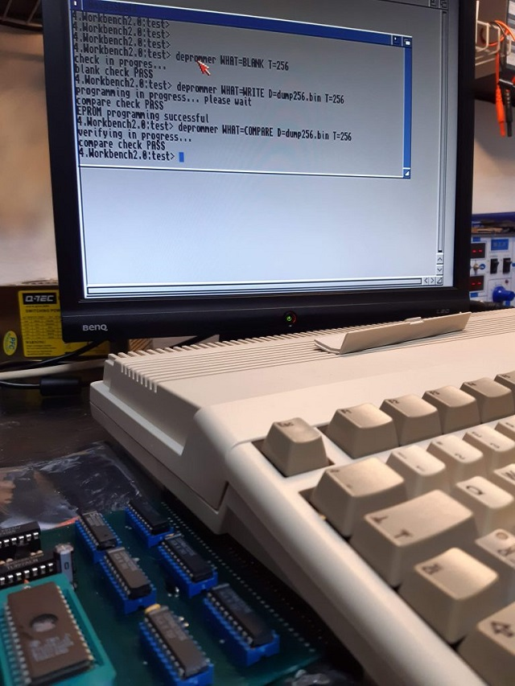
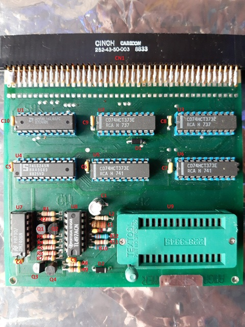
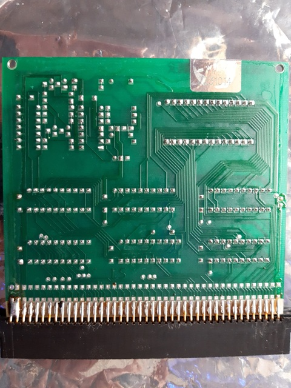

# DELA Eprommer for Amiga 500 — Reverse Engineering

Reverse engineering of the **DELA Eprommer**, a small EPROM programmer for the Amiga 500 produced by Dela Elektronik in the late 1980s, and a CLI program written from scratch to operate it.

[](img/deprommer.jpg)

## What it was

The DELA Eprommer is an EPROM programmer that plugs into the Amiga 500 side expansion connector. It can read and program EPROMs of type **2764, 27C128, 27C256 and 27C512**, with selectable VPP voltage of **12.5V or 21V** to support different EPROM families and programming specifications.

Reference: [Amiga Hardware Database — Dela Eprommer](http://amiga.resource.cx/exp/delaeprommer)

The unit covered by this project was bought without software, and no usable software for this specific model could be found online. This repository is the result of reverse engineering the board from scratch and writing a small control program (`Deprommer`) to read, program and verify EPROMs from the Amiga CLI.

## Hardware overview

The board is built around a handful of standard logic chips:

| Ref | Part | Function |
|---|---|---|
| U1 | AmPAL16L8 | Address decoding / chip enable generation |
| U2, U5 | 74HCT373 | Data and control latches |
| U3, U6 | 74HCT373 | Address latches (A0-A15 to the EPROM) |
| U4 | 74LS245 | Bidirectional transceiver for EPROM data read |
| U7 | 7406 | Hex inverter (drives the VPP/VCC switching transistors) |
| U8 | TL497A | Switching voltage regulator (generates VPP) |
| Q1-Q4 | BJT | Switches for VPP-pin1, VPP-pin22, POW (12.5V/21V), and VCC |

 
 
</br></br>
The board has no silkscreen reference designators — labels above are those assigned during reverse engineering.

## Address map

The PAL (`U1`) decodes three addresses in the $700000 region of the Amiga address space:

| Address | Access | Function |
|---|---|---|
| `$700002` | write | Latch EPROM address bus (A0-A15) |
| `$700004` | write | Latch EPROM data + control signals |
| `$700008` | read | Read EPROM data byte (D0-D7) via the 74LS245 |

## Control register at $700004

Bits in the 16-bit word written to `$700004` map as follows:

| Bit | Name | Function |
|---|---|---|
| D15 | — | not used |
| D14 | EL | Output Enable of U5 (data latch); low = data is driven into the EPROM |
| D13 | VCC | EPROM VCC (pin 28) on/off |
| D12 | POW | VPP voltage selection: 12.5V or 21V |
| D11 | CE | EPROM Chip Enable |
| D10 | OE | EPROM Output Enable |
| D9 | GVPP | VPP routed to pin 22 (used for 27C512) |
| D8 | VPP | VPP routed to pin 1 (used for 2764/128/256) |
| D7-D0 | data | Byte to be written into the EPROM |

The address latch at `$700002` carries A0-A15 of the EPROM in the lower 16 bits. For 2764 and 27C128, the upper address bits double as control signals: A14 is reused as `/PGM` (programming pulse) and A15 as VPP — which is why the three EPROM families require three different programming algorithms.

## What this repository contains

- KiCad schematic of the reverse-engineered board
- JEDEC fuse map and decoded equations of the PAL16L8 (`pal/`)
- Bill of materials (`BOM.xlsx`)
- Component reference list
- The **Deprommer** CLI program (C + 68k assembly) under `Deprommer/`
- Board photographs (`img/`)

## Deprommer (the software)

`Deprommer` is a small command-line program for the Amiga that drives the board to read, program, blank-check and verify EPROMs. Programming pulses and read cycle timing are implemented in inline 68000 assembly, using the Amiga CIA-A timer for delay loops.

Current functionality:

- Read an EPROM contents to a file
- Program an EPROM from a file (with read-back verification)
- Compare an EPROM against a file
- Blank-check an EPROM

Usage:

```
DePrommer WHAT=<READ|WRITE|COMPARE|BLANK> D=<filename> T=<64|128|256|512>
```

where `T` selects the EPROM type (2764, 27C128, 27C256, 27C512).

## Status and known limitations

The program is a **proof of concept**. It works on the EPROMs that were available for testing during development, but it has known limitations:

- No support for manufacturer-specific fast programming algorithms (Intel Quick-Pulse, Atmel Rapid Programming, etc.) — only the basic "slow" algorithm with retry-on-mismatch is implemented
- No support for variants that differ in programming voltage or pulse width across manufacturers
- 21V VPP mode (`WRITEH`) is declared in the CLI but not yet implemented
- No reading of the EPROM electronic signature (manufacturer/device ID)
- No support for Intel HEX or Motorola S-Record file formats — binary only

A refactor and a Workbench GUI are planned. Contributions and pull requests welcome.

## License

This work is licensed under a Creative Commons Attribution 4.0 International License. See <https://creativecommons.org/licenses/by/4.0/>.

  If you found this my work useful, please consider buying me a cup of coffee if you want:<br>
<a href='https://ko-fi.com/na103' target='_blank'></a>


